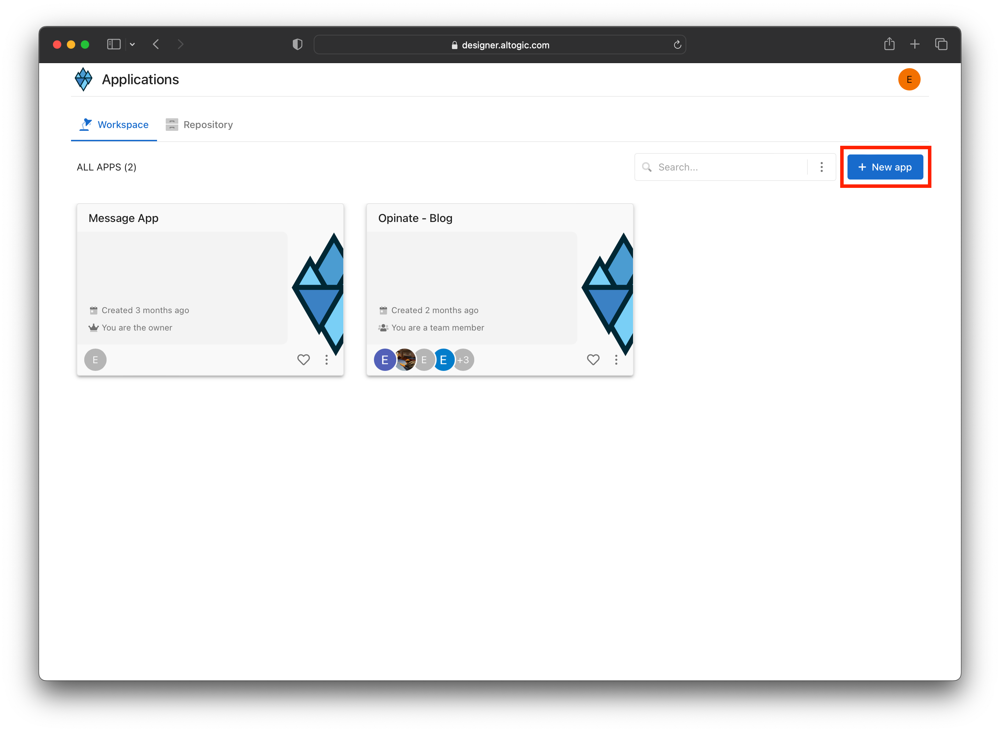

# Authentication with Nuxt 3 & Altogic

## Introduction
**Altogic** is a Backend as a Service (BaaS) platform and provides a variety of services in modern web and mobile development. Most of the modern applications using React or other libraries/frameworks require to know the identity of a user. And this necessity allows an app to securely save user data and session in the cloud and provide more personalized functionalities and views to users.

Altogic has an Authentication service that integrates and implements well in JAMstack apps. It has a ready-to-use Javascript client library, and it supports many authentication providers such as email/password, phone number, magic link, and OAuth providers like Google, Facebook, Twitter, Github, etc.,

In this tutorial, we will implement email/password authentication with Vue.js and take a look how as a Vue developer we build applications and integrate with Altogic Authentication.

After completion of this tutorial, you will learn:

* How to create sample screens to display forms like login and signup.
* How to create a home screen and authorize only logged-in users.
* How to create different routes using the vue-router.
* How to create an authentication flow by conditionally rendering between these pages whether a user is logged-in or not.
* How to authenticate users using magic link
* How to update user profile info and upload a profile picture
* And we will integrate Altogic authentication with the email/password method.

If you are new to Next applications, this tutorial is definitely for you to understand the basics and even advanced concepts.


## Prerequisites
* Altogic account (if you have not one yet, you can create an account by sign-in up to **Altogic**)
* Familiarity with the command line
* Any text editor or IDE (WebStorm, VsCode, Sublime, Atom, etc.)
* Basic knowledge of Javascript
* Basic knowledge of Next.js

## Creating an Altogic App
We will use Altogic as a backend service platform, so let’s visit [Altogic Designer](https://designer.altogic.com/) and create an account.


After creating an account, you will see the workspace where you can access your apps.

Click + New app and follow the instructions;

1. In the App name field, enter a name for the app.
2. Enter your subdomain.
3. Choose the deployment location.
4. And select your free execution environment pricing plan.


Then click Next and select Basic Authentication template. This template is creates a default user model for your app which is required by [Altogic Client Library](https://github.com/altogic/altogic-js) to store user data and manage authentication.

Then click Next and select Basic Authentication template. This template is based on session authentication and highly recommended to secure your apps.


Then click Next to confirm and create an app.

Awesome! We have created our application; now click/tap on the **newly created app to launch the Designer.**

> This is the only configuration we need to do in Altogic Designer. In order to access the app and use the Altogic client library, we should get envUrl and clientKey of this app.
Click the **Home** icon at the left sidebar to copy the envUrl and clientKey.


Once the user created successfully, our Vue.js app will route the user to the Verification page, and a verification email will be sent to the user’s email address. When the user clicks the link in the mail, the user will navigate to the redirect page to grant authentication rights. After successfully creating a session on the Redirect page, users will be redirected to the Home page.

## Quick Tip
> If you want, you can deactivate or customize the mail verification from **App Settings -> Authentication** in Logic Designer.

## Create a Next.js project
```bash
yarn create next-app
```


I showed you which options to choose in the image I will give you below. You can choose the same options as I did.


## Integrating with Altogic
Our backend and frontend is now ready and running on the server. ✨

Now, we can install the Altogic client library to our React app to connect our frontend with the backend.

```sh
# using npm
npm install altogic
# OR is using yarn
yarn add altogic
```

Let’s create a configs/ folder inside of the src/ directory to add altogic.js file.

Open altogic.js and paste below code block to export the altogic client instance.

/src/configs/altogic.js

```javascript
import { createClient } from "altogic";

// This `envUrl` and `clientKey` is sample you need to create your own.
let envUrl = "https://auth.c1-europe.altogic.com";
let clientKey = "ccf9aab72f47484bba21e1706d61df0c";

const altogic = createClient(envUrl, clientKey);

// We will use this function in server-side.
export const altogicWithToken = (token) => {
  altogic.auth.setSession({ token });
  return altogic;
};

export default altogic;
```

> Replace envUrl and clientKey which is shown in the <strong>Home</strong> view of [Altogic Designer](https://designer.altogic.com/).

## Create Routes

Nuxt has built-in file system routing. It means that we can create a page by creating a file in the **pages/** directory.

Let's create some views in **pages/** folder as below:
* index.js
* sign-in.js
* sign-up.js
* auth-redirect.js
* magic-link.js
* profile.js

### Replacing pages/index.js with the following code:
```javascript
import Link from "next/link";

function IndexView() {
  return (
    <div className="flex items-center justify-center gap-4 h-screen">
      <Link class="border px-4 py-2 font-medium text-xl" href="/magic-link">
        Login With Magic Link
      </Link>
      <Link class="border px-4 py-2 font-medium text-xl" href="/sign-in">
        Sign In
      </Link>
      <Link class="border px-4 py-2 font-medium text-xl" href="/sign-up">
        Sign Up
      </Link>
    </div>
  );
}
export default IndexView;
```

### Replacing pages/sign-in.js with the following code:
```javascript
import Link from "next/link";
import { useRouter } from "next/router";
import { useState } from "react";

function SignInView() {
  const router = useRouter();

  const [inpEmail, setInpEmail] = useState("evrenvural4@gmail.com");
  const [inpPassword, setInpPassword] = useState("123456789");

  const [error, setError] = useState(null);
  const [loading, setLoading] = useState(false);

  const handleSignIn = async () => {
    try {
      setLoading(true);
      const response = await fetch("/api/auth/signIn", {
        method: "POST",
        body: JSON.stringify({
          email: inpEmail,
          password: inpPassword,
        }),
      });

      if (!response.ok) {
        const { errors } = await response.json();
        throw errors;
      }
      router.replace("/profile");
    } catch (err) {
      setLoading(false);
      setError(err.items);
    }
  };

  return (
    <section className="flex flex-col items-center justify-center h-96 gap-4">
      <div className="flex flex-col gap-2 w-full md:w-96">
        <h1 className="self-start text-3xl font-bold">Login to your account</h1>
        {error?.map(({ message }) => (
          <div key={message} className="bg-red-600 text-white text-[13px] p-2">
            <p>{message}</p>
          </div>
        ))}

        <input
          type="email"
          placeholder="Type your email"
          onChange={(e) => setInpEmail(e.target.value)}
          value={inpEmail}
        />
        <input
          autoComplete="new-password"
          type="password"
          placeholder="Type your password"
          onChange={(e) => setInpPassword(e.target.value)}
          value={inpPassword}
        />
        <div className="flex justify-between gap-4">
          <Link className="text-indigo-600" href="/sign-up">
            Don't have an account? Register now
          </Link>
          <button
            type="submit"
            className="border py-2 px-3 border-gray-500 hover:bg-gray-500 hover:text-white transition shrink-0"
            disabled={loading}
            onClick={handleSignIn}
          >
            Login
          </button>
        </div>
      </div>
    </section>
  );
}

export default SignInView;
```

### Replacing pages/magic-link.js with the following code:
```javascript
import Link from "next/link";
import { useState } from "react";
import altogic from "../configs/altogic";

function MagicLinkView() {
  const [inpEmail, setInpEmail] = useState("");

  const [success, setSuccess] = useState("");
  const [errors, setErrors] = useState(null);
  const [loading, setLoading] = useState(false);

  async function loginHandler() {
    setLoading(true);
    setErrors(null);

    const { errors: apiErrors } = await altogic.auth.sendMagicLinkEmail(
      inpEmail
    );
    setLoading(false);

    if (apiErrors) {
      setErrors(apiErrors.items);
    } else {
      setInpEmail("");
      setSuccess("Email sent! Check your inbox.");
    }
  }

  return (
    <section className="flex flex-col items-center justify-center h-96 gap-4">
      <div className="flex flex-col gap-2 w-full md:w-96">
        <h1 className="self-start text-3xl font-bold">Login with magic link</h1>
        {success && (
          <div className="bg-green-600 text-white text-[13px] p-2">
            {success}
          </div>
        )}
        {errors && (
          <div className="bg-red-600 text-white text-[13px] p-2">
            {errors.map(({ message }) => (
              <p key={message}>{message}</p>
            ))}
          </div>
        )}

        <input
          type="email"
          placeholder="Type your email"
          onChange={(e) => setInpEmail(e.target.value)}
          value={inpEmail}
        />
        <div className="flex justify-between gap-4">
          <Link class="text-indigo-600" href="/sign-up">
            Don't have an account? Register now
          </Link>
          <button
            disabled={loading}
            type="submit"
            className="border py-2 px-3 border-gray-500 hover:bg-gray-500 hover:text-white transition shrink-0"
            onClick={loginHandler}
          >
            Send magic link
          </button>
        </div>
      </div>
    </section>
  );
}

export default MagicLinkView;
```

### Replacing pages/sign-up.js with the following code:
```javascript
import { useState } from "react";
import Link from "next/link";
import { useRouter } from "next/router";

function SignUpView() {
  const router = useRouter();

  const [inpName, setInpName] = useState("");
  const [inpEmail, setInpEmail] = useState("");
  const [inpPassword, setInpPassword] = useState("");

  const [loading, setLoading] = useState(false);
  const [success, setSuccess] = useState("");
  const [error, setError] = useState(null);

  const handleSignUp = async () => {
    try {
      setLoading(true);
      const response = await fetch("/api/auth/signUp", {
        method: "POST",
        body: JSON.stringify({
          name: inpName,
          email: inpEmail,
          password: inpPassword,
        }),
      });
      const { session, errors } = await response.json();

      if (!response.ok) {
        throw errors;
      }

      if (session) {
        router.replace("/profile");
      } else {
        setSuccess(`We sent a verification link to ${inpEmail}`);
        setError(null);
        setLoading(false);
      }
    } catch (err) {
      setSuccess(null);
      setError(err.items);
      setLoading(false);
    }
  };

  return (
    <section className="flex flex-col items-center justify-center h-96 gap-4">
      <div className="flex flex-col gap-2 w-full md:w-96">
        <h1 className="self-start text-3xl font-bold">Create an account</h1>
        {success && (
          <div className="bg-green-500 text-white p-2">{success}</div>
        )}
        {error?.map(({ message }) => (
          <div key={message} className="bg-red-600 text-white text-[13px] p-2">
            <p>{message}</p>
          </div>
        ))}

        <input
          type="text"
          placeholder="Type your name"
          onChange={(e) => setInpName(e.target.value)}
          value={inpName}
        />
        <input
          type="email"
          placeholder="Type your email"
          onChange={(e) => setInpEmail(e.target.value)}
          value={inpEmail}
        />
        <input
          autoComplete="new-password"
          type="password"
          placeholder="Type your password"
          onChange={(e) => setInpPassword(e.target.value)}
          value={inpPassword}
        />
        <div className="flex justify-between gap-4">
          <Link className="text-indigo-600" href="/sign-in">
            Already have an account?
          </Link>
          <button
            type="submit"
            className="border py-2 px-3 border-gray-500 hover:bg-gray-500 hover:text-white transition shrink-0"
            disabled={loading}
            onClick={handleSignUp}
          >
            Register
          </button>
        </div>
      </div>
    </section>
  );
}

export default SignUpView;
```

### Replacing pages/profile.js with the following code:
```javascript
import { useRouter } from "next/router";
import { useState } from "react";
import Avatar from "../components/Avatar";
import Sessions from "../components/Sessions";
import UserInfo from "../components/UserInfo";
import altogic from "../configs/altogic";

function ProfileView({ userProp, sessionsProp }) {
  const router = useRouter();

  const [user, setUser] = useState(userProp);
  const [sessions, setSessions] = useState(sessionsProp);

  const handleSignOut = async () => {
    try {
      const response = await fetch("/api/auth/signOut", {
        method: "POST",
      });
      const { errors } = await response.json();

      if (!response.ok) {
        throw errors;
      }
      router.push("sign-in");
    } catch (err) {
      console.error(err);
    }
  };

  return (
    <section className="h-screen py-4 space-y-4 flex flex-col text-center items-center">
      <Avatar user={user} setUser={setUser} />
      <UserInfo user={user} setUser={setUser} />
      <Sessions sessions={sessions} setSessions={setSessions} />
      <button
        className="bg-gray-400 rounded py-2 px-3 text-white"
        onClick={handleSignOut}
      >
        Sign Out
      </button>
    </section>
  );
}

export async function getServerSideProps(context) {
  const token = context.req.cookies.session_token;
  const { user, errors } = await altogic.auth.getUserFromDBbyCookie(
    context.req,
    context.res
  );

  if (!user) {
    return {
      redirect: {
        destination: "/sign-in",
        permanent: false,
      },
    };
  }

  const { sessions } = await altogic.auth.getAllSessions();
  const sessionsProp = sessions.map((session) =>
    session.token === token ? { ...session, isCurrent: true } : session
  );
  return {
    props: { userProp: user, sessionsProp },
  };
}

export default ProfileView;

```

### Replacing pages/auth-redirect.js with the following code:
```javascript
import Link from "next/link";
import { useRouter } from "next/router";
import altogic from "../configs/altogic";

function AuthRedirectView() {
  return (
    <div>
      <div>Redirecting...</div>
    </div>
  );
}

export async function getServerSideProps(context) {
  const { access_token } = context.query;
  const { user, session } = await altogic.auth.getAuthGrant(access_token);

  if (user) {
    altogic.auth.setSessionCookie(session.token, context.req, context.res);
    altogic.auth.setSession(session);

    return {
      redirect: {
        destination: "/profile",
        permanent: false,
      },
    };
  }

  return {
    redirect: {
      destination: "/sign-in",
      permanent: false,
    },
  };
}

export default AuthRedirectView;

```

# Let's get to the most important point
Next is a server side rendering tool, we will do some operations on the backend. So we need to create a folder named **api** in pages directory.


## Let's create a api folder
Create a folder named **auth** in pages/api.

And create files in api folder like image in below


### Replacing pages/api/signIn.js with the following code:
In this file, we have created an endpoint for users to login. And here we are logging in by assigning the session token returned from altogic to the cookie.
```js
import altogic from "../../../configs/altogic";

export default async function handler(req, res) {
  const { email, password } = JSON.parse(req.body);

  const { user, session, errors } = await altogic.auth.signInWithEmail(
    email,
    password
  );

  if (errors) {
    res.status(errors.status).json({ errors });
  } else {
    altogic.auth.setSessionCookie(session.token, req, res);
    altogic.auth.setSession(session);
    res.status(200).json({ user, session });
  }
}
```

### Replacing pages/api/signUp.js with the following code:
```js
import altogic from "../../../configs/altogic";

export default async function handler(req, res) {
  const { name, email, password } = JSON.parse(req.body);

  const { user, session, errors } = await altogic.auth.signUpWithEmail(
    email,
    password,
    name
  );

  if (errors) {
    res.status(errors.status).json({ errors });
  } else {
    if (session) {
      altogic.auth.setSessionCookie(session.token, req, res);
      altogic.auth.setSession(session);
    }
    res.status(200).json({ user, session });
  }
}
```

### Replacing pages/api/signOut.js with the following code:
```js
import { altogicWithToken } from "../../../configs/altogic";

export default async function handler(req, res) {
  const token = req.cookies.session_token;
  const { errors } = await altogicWithToken(token).auth.signOut();
  res.removeHeader("session_token");

  if (errors) {
    res.status(errors.status).json({ errors });
  } else {
    res.status(200).json({ data: true });
  }
}
```

## Bonus: Upload Profile Photo
Let's create a Vue component for user can upload a profile photo. Create a folder named **components** in your project root directory.

```javascript
// components/Avatar.js
import { useState } from "react";
import altogic from "../configs/altogic";

function Avatar({ user, setUser }) {
  const [loading, setLoading] = useState(false);
  const [errors, setErrors] = useState(null);

  const handleFileChange = async (e) => {
    const file = e.target.files[0];
    e.target.value = null;
    if (!file) return;
    try {
      setLoading(true);
      setErrors(null);
      const { publicPath } = await updateProfilePicture(file);
      const updatedUser = await updateUser({ profilePicture: publicPath });
      setUser(updatedUser);
    } catch (e) {
      setErrors(e.message);
    } finally {
      setLoading(false);
    }
  };
  const updateProfilePicture = async (file) => {
    const { data, errors } = await altogic.storage
      .bucket("root")
      .upload(file.name, file);
    if (errors) throw new Error("Couldn't upload file");
    return data;
  };
  const updateUser = async (data) => {
    const { data: updatedUser, errors } = await altogic.db
      .model("users")
      .object(user._id)
      .update(data);
    if (errors) throw new Error("Couldn't update user");
    return updatedUser;
  };

  return (
    <div>
      <figure className="flex flex-col gap-4 items-center justify-center py-2">
        <picture className="border rounded-full w-24 h-24 overflow-hidden">
          
        </picture>
      </figure>
      <div className="flex flex-col gap-4 justify-center items-center">
        <label className="border p-2 cursor-pointer">
          <span>{loading ? "Uploading..." : "Change Avatar"}</span>

          <input
            disabled={loading}
            className="hidden"
            type="file"
            accept="image/*"
            onChange={handleFileChange}
          />
        </label>
        {errors && <div className="bg-red-500 p-2 text-white">{errors}</div>}
      </div>
    </div>
  );
}

export default Avatar;
```

## Conclusion
Congratulations!✨

You had completed the most critical part of the Authentication flow, which includes private routes, sign-up, sign-in, and sign-out operations.

If you have any questions about Altogic or want to share what you have built, please post a message in our [community forum](https://community.altogic.com/home) or [discord channel](https://discord.gg/zDTnDPBxRz).

